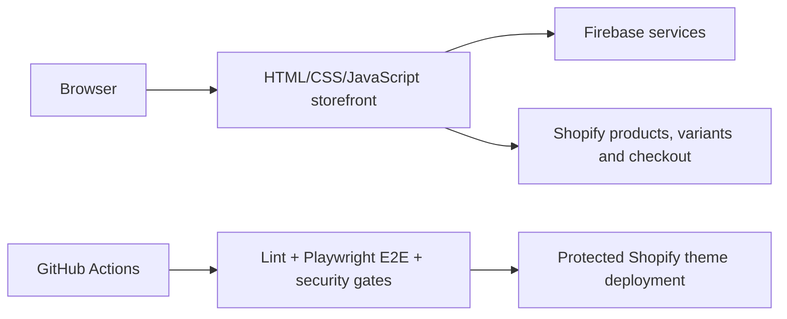

# MyWowPet

Shopify-connected pet e-commerce storefront with Firebase services, Playwright end-to-end testing, GitHub Actions CI/CD, and automated DevSecOps gates.

[Live launch page](https://www.mywowpet.com)

## Why this project exists

MyWowPet demonstrates how to deliver a branded commerce experience while separating concerns across a custom storefront, Firebase application services, Shopify commerce capabilities, and an automated delivery pipeline.

## Architecture



## Key capabilities

- 24-product Shopify product and variant mapping
- safe purchase behavior when a valid variant is unavailable
- cart and checkout integration
- desktop and mobile Playwright testing
- nightly regression workflow
- Gitleaks secret detection
- Semgrep static analysis
- Trivy dependency and configuration scanning
- CI/CD guidance for Shopify theme deployment
- architecture, audit, training, and operations documentation

## Quality and delivery

```bash
npm install
npx playwright install --with-deps
npm test
```

Useful commands:

```bash
npm run lint
npm run test:headed
npm run test:ui
npm run test:chromium
npm run test:report
```

## Documentation

- [Master technology book](MYWOWPET_TECH_BOOK.md)
- [Shopify product mapping audit](PRODUCT_SHOPIFY_AUDIT.md)
- [CI/CD configuration guide](CICD_README.md)
- [DevSecOps runbook](DevSecOps_Runbook.md)
- [Training guide](TRAINING_DOC.md)

## Security

Never commit Shopify access tokens, private API credentials, or `.env` files. Repository workflows use GitHub secrets and least-privilege permissions. Review the latest Actions and Security results before deploying.

## Portfolio context

This is a hands-on AI-assisted build. AI accelerated ideation, implementation, debugging, testing, and documentation; final requirements, architecture choices, integration decisions, validation, and release controls remained human-owned.

## Current status

The public domain currently displays a launch/coming-soon experience. Repository documentation and implementation files provide evidence of the underlying storefront, Shopify integration, automated testing, and delivery controls.
